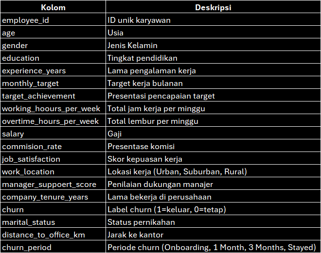
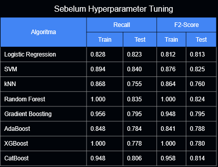
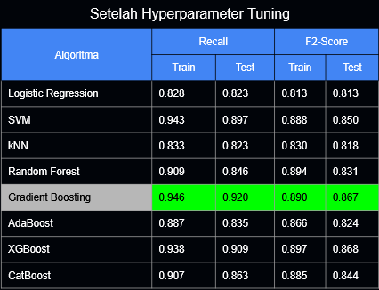

# Rakamin Final Project
Model Prediksi churn yang dilakukan oleh Vortech

# Machine Learning Pipeline: Employee Churn Prediction 
## 1. Data Overview 

- Sumber Data: employee_churn_prediction_updated.csv
- Jumlah Data: 1000 baris × 19 kolom awal
- Target: churn (biner: 0 = Stayed, 1 = Churn)
- Fitur Utama:
    - Demografi: age, gender, marital_status
    - Karir: experience_years, education, company_tenure_years
    - Performa: monthly_target, target_achievement, working_hours_per_week, overtime_hours_per_week
    - Kompensasi: salary, commission_rate, distance_to_office_km
    - Psikologis: job_satisfaction, manager_support_score
    - Kontekstual: work_location, churn_period

## 2. Data Quality & Preprocessing 
### 2.1. Validasi Data 

- Tidak ada nilai null.
- Tidak ada ID duplikat (employee_id unik).
- Inkonsistensi data diverifikasi: churn dan churn_period selaras.

### 2.2. Penanganan Anomali 
- Kriteria Anomali: experience_years > (age - 18)
- Temuan: 74 baris anomali terdeteksi.
- Tindakan: Baris anomali dihapus, menyisakan 926 data valid.

### 2.3. Feature Engineering 
- Encoding:
    - gender → gender_Male (binary)
    - marital_status → is_married (binary)
    - education → ordinal (education_ord)
    - work_location → one-hot (work_location_Urban, Suburban, Rural)
    - company_tenure_years → ordinal (tenure_ord)
- Fitur Turunan:
    - total_workload = working_hours_per_week + overtime_hours_per_week
    - performance_efficiency = target_achievement / total_workload
    - salary_to_target_ratio, salary_per_exp
- Fitur interaksi:
    - long_distance_overwork
    - high_ot_low_sat
    - support_satisfaction_interaction

### 2.4. Final Feature Set 
- Total fitur: 30 kolom (setelah encoding & engineering)
- Kolom target: churn (biner)

## 3. Train-Test Split & Class Imbalance 

- Split: train_test_split(test_size=0.3, stratify=y, random_state=42)
    - Train: 648 baris
    - Test: 278 baris

> Class Imbalance: Target churn tidak seimbang → SMOTE digunakan untuk oversampling kelas minoritas pada data latih.

## 4. Modeling & Hyperparameter Tuning 
Model dievaluasi berdasarkan Recall dan F2-Score (β=2) karena fokus pada deteksi churn dan false alarm dari recall. 

### 4.1. Algoritma yang Diujikan
- Logistic Regression
- SVM
- kNN
- Random Forest
- Gradient Boosting
- AdaBoost
- XGBoost
- CatBoost

## 5. Evaluasi Model 
Model diuji dan di train dengan melihat baseline model dan hyperparameter tuning untuk melihat apakah model belajar dari data train

### 5.1. Metrik Utama 
- Train/Test Evaluation: Recall, F2-Score, PR-AUC
- Fokus: Recall tinggi → minimalkan false negative (karyawan churn yang tidak terdeteksi)

### 5.2. Model Terbaik 

> sebelum tuning banyak model yang overfit, **kecuali Logistic Regression** selain stabil performanya juga bagus

> Setelah dilakukan tuning beberapa model performanya meningkat seperti **SVM & AdaBoost**, Logistic Regression performanya stagnan. Dari beberapa pertimbangan dan penilaian terpilih model dengan **Gradient Boosting**

# 6. Model Deployment
Kami men-deploy model ke dalam WebApps dengan Streamlit yang bisa di akses pada link berikut:

[Prediksi Churn]([www.google.com](https://churn-prediction-vortech.streamlit.app/))

Dengan fitur sebagai berikut
1. **Penyesuaian threshold**: sebagai ambang batas/toleransi prediksi
2. **Multi Input Mode**: Single predict & batch predict
3. **Fairness Analysis**: Sebagai monitoring performa model terhadap data baru

# 🔗 File Sumber Diagram
Jika Anda ingin melihat detail atau melakukan modifikasi pada diagram ini, Anda dapat mengunduh dan membukanya di draw.io:

[Unduh File Sumber Draw.io](assets/pipeline_ml.drawio)
