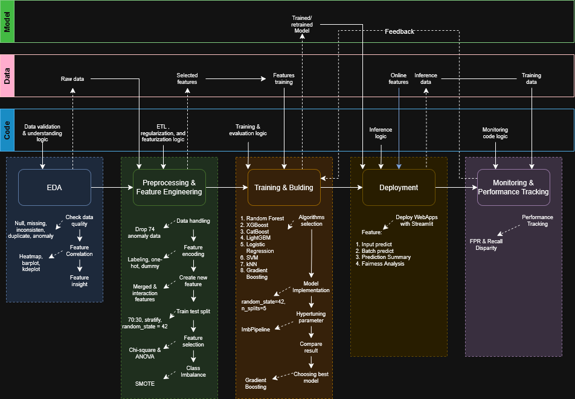

# Rakamin Final Project
Model Prediksi churn yang dilakukan oleh Vortech

Pipeline terdiri dari langkah-langkah utama berikut:
1.  **EDA:** Memahami data dan korelasi antar fitur.
2.  **PreProcessing & Feature Engineering:** Normalisasi struktur data dan *encoding* variabel kategorikal.
3.  **Training & Building:** Melatih model **XGBoost, Random Forest, CatBoost, LightGBM, Logistic Regression** dan mengevaluasinya.

## 🔗 File Sumber Diagram

Jika Anda ingin melihat detail atau melakukan modifikasi pada diagram ini, Anda dapat mengunduh dan membukanya di draw.io:

[Unduh File Sumber Draw.io](assets/pipeline_ml.drawio)